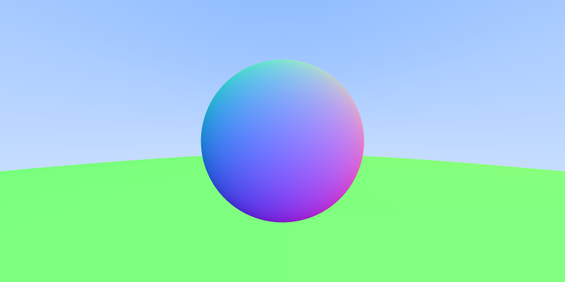
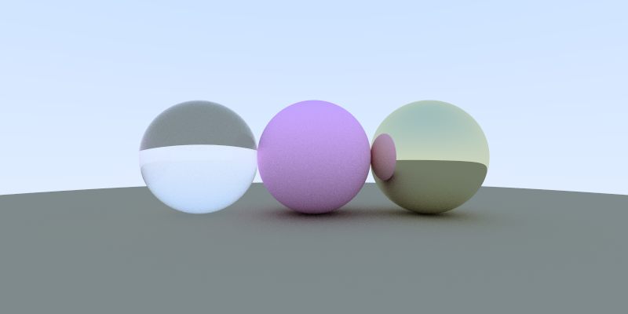
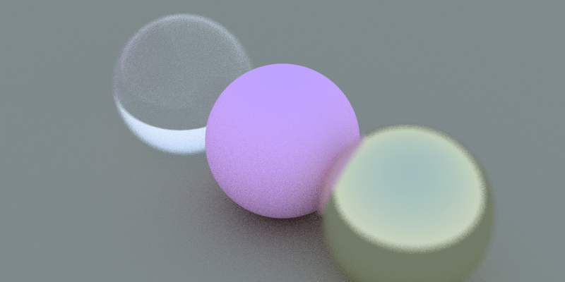
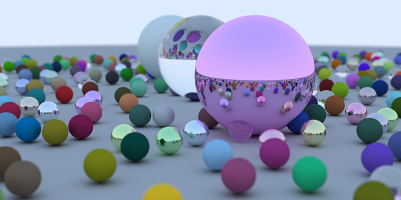

Ray Tracing in a Summer
==========================
Ever since I discovered the power of raytracing as a pre-teen, hudled over my computer creating my first donught in Blender, I knew it would become one of my major interests. 

This summer I have tasked myself with finally learning the basics, and a little more, of programming ray tracing. My highschool math teacher and one of my main insperations Mr.Fryer-Davis introduced me to this series back in highschool, at that time I was afraid of C based languages so I lost my steam. 

Fast forward to summer of 2024, with one year of university under my belt I have completed a course in C and feel a lot more comfortable in picking up C++. 
I see this as a good way to kill two birds with one stone, as I have an upcoming object oriented programming cource in C++. This will allow me to get a headstart on learning the language.

Huge credits to Peter Shirley's [_Ray Tracing in One Weekend_](https://raytracing.github.io/books/RayTracingInOneWeekend.html) 
It is phenomenly writen and I highly suggest anyone interested in learning the basics of ray tracing check it out!

### Current Goals: 
- Add support for objects other then spheres 😂
- Add texture support
- Add a GUI for moving objects and the camera around
- Add GPU support using CUDA

### Results:

